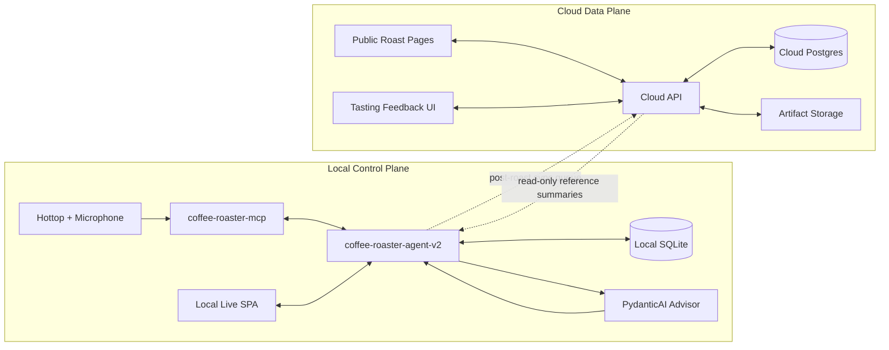
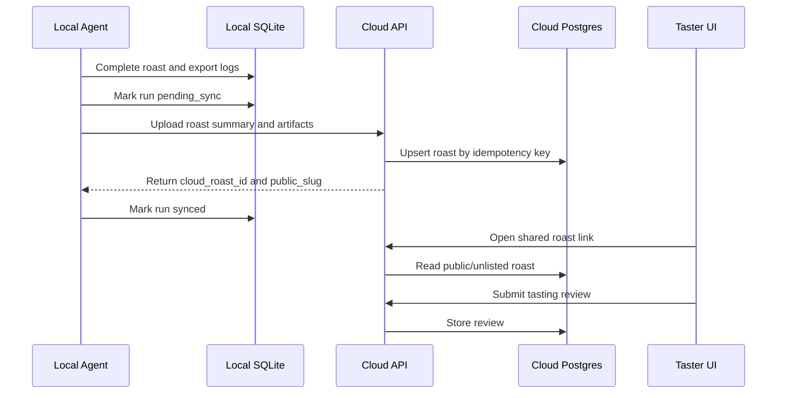
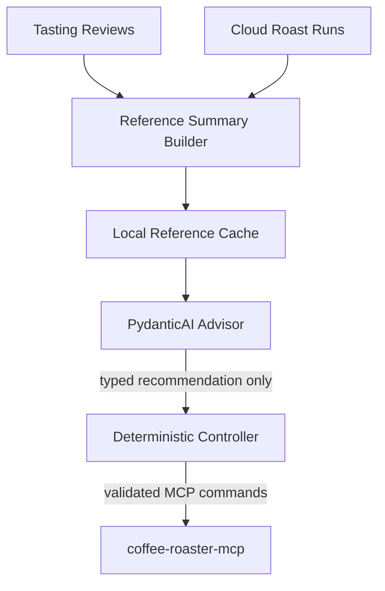
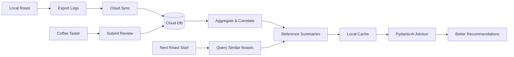
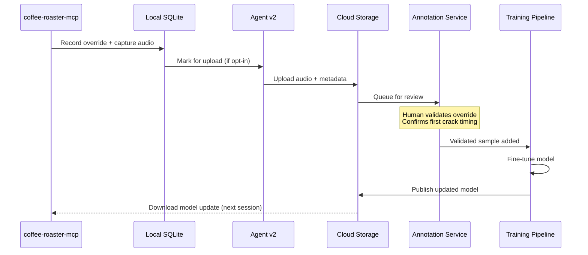

# RoastPilot Agent v2: Production Orchestration Plan

## Summary

RoastPilot Agent v2 is the production orchestration layer for autonomous coffee
roasting. It replaces the prototype n8n-style agent loops with a deterministic
local appliance service.

The core decision is:

- Use a Python-first local service.
- Use PydanticAI for typed advisory decisions.
- Do not use OpenAI Agents SDK.
- Keep the LLM advisory-only.
- Keep all roaster write actions inside deterministic controller and safety code.
- Expose a SPA-facing API from the agent service.
- Keep `coffee-roaster-mcp` as the deterministic machine/session boundary.
- Keep the active roast local-first; cloud services are for sharing, history,
  feedback, and future read-only advisor context.

The LLM should help interpret roast dynamics, especially after first crack, but
it must not own the loop, phase transitions, hardware commands, safety limits,
or recovery behavior.

## System Architecture

`coffee-roaster-mcp` remains the authoritative local MCP server for:

- roaster control
- first-crack detection
- automatic T0 detection
- session lifecycle
- telemetry snapshots
- roast event timeline
- snapshot log export

`coffee-roaster-agent-v2` owns:

- orchestration state machine
- UI API
- operator workflow
- local persistence
- safety policy
- advisory-agent calls
- command validation
- restart and recovery behavior

The SPA talks only to `coffee-roaster-agent-v2`. It must not call MCP tools
directly. This keeps one backend authority responsible for hardware control and
operator-visible state.

```text
SPA
  |
  | REST + SSE
  v
coffee-roaster-agent-v2
  |
  | deterministic MCP client wrapper
  v
coffee-roaster-mcp
  |
  | driver/audio/model boundaries
  v
Hottop roaster + microphone + released Hugging Face ONNX artifacts
```

### Hardware Characteristics

The Hottop KN-8828B-2K+ hardware imposes physical constraints on the control loop:

- **Dual K-type thermocouples**: Typical response time of 0.5-2 seconds to reach 63%
  of actual temperature change
- **Temperature display**: Manual states temperatures are displayed "in real time" and
  "constantly," but physical sensor limitations mean unique readings occur at ~1 Hz
- **Serial protocol**: 115200 baud, 36-byte packets streaming continuously, but
  temperature values inside packets don't change faster than sensors can respond
- **Reference implementation**: pyhottop library uses 0.6-1.0 second polling intervals;
  changelog notes "adjusted default interval to 1 second to avoid buffer issues"
- **MCP polling**: The MCP server command loop runs at 0.3s intervals, but consecutive
  reads often return identical temperature values within ~1 second windows

These characteristics inform the agent controller's 1.0 second tick rate and the
advisory call frequency policy.

The architecture has two planes:

- Local control plane: safety-critical, works without internet, owns active
  roast control.
- Cloud data plane: public/community-facing, non-safety-critical, stores shared
  roast logs and tasting feedback.



Cloud sync must never be required for active roast safety. If the cloud is down,
the local controller continues the roast, stores all state locally, and retries
sync later.

## Runtime Flow

The normal roast flow is:

1. Operator starts a roast from the SPA.
2. Agent service creates a local run record.
3. Agent service starts one MCP roast session.
4. Controller enters `preheating`.
5. Controller sets initial heat/fan according to profile and safety policy.
6. Controller polls MCP state on a monotonic fixed-rate schedule.
7. When bean or environment temperature enters the configured charge guidance
   range, default `170 C` to `200 C`, controller emits a non-blocking UI message
   that beans can be added.
8. Controller keeps polling MCP state while preheat controls continue according
   to policy.
9. T0 is accepted from MCP automatic T0 detection. Explicit operator marking is
   recovery-only.
10. Controller enters `roasting_pre_first_crack` when MCP reports T0.
11. Controller monitors MCP first-crack status.
12. First crack is accepted from MCP audio detection, or from explicit operator
   override.
13. Controller enters `development`.
14. Controller calls the PydanticAI advisor at configured decision points.
15. Advisor returns a typed recommendation only.
16. Safety policy validates, clamps, or rejects the recommendation.
17. Controller executes approved MCP commands.
18. Controller uses `drop_beans` as the normal drop/cooling transition.
19. Controller monitors cooling.
20. Operator or policy stops cooling when complete.
21. Controller exports MCP logs and marks the run complete.

`start_cooling` is not part of the normal drop path. It remains a manual recovery
operation because `drop_beans` is the normal MCP command for drop plus cooling.

## State Machine

The controller should be a code-owned deterministic state machine. It can be
implemented as an explicit enum and transition table before adopting an external
state-machine dependency.

Initial states:

- `idle`
- `starting`
- `preheating`
- `roasting_pre_first_crack`
- `development`
- `cooling`
- `complete`
- `faulted`
- `operator_recovery_required`

State transitions must be explicit and test-covered. The advisor cannot trigger
state transitions directly. It can only recommend control targets or a drop
candidate during states where advisory decisions are allowed.

Recommended transition ownership:

- `idle -> starting`: operator starts roast.
- `starting -> preheating`: MCP session started successfully.
- `preheating -> roasting_pre_first_crack`: MCP reports confirmed T0 from
  automatic bean detection.
- `roasting_pre_first_crack -> development`: first crack detected or overridden.
- `development -> cooling`: validated drop decision or operator drop.
- `cooling -> complete`: cooling stopped and logs exported.
- `* -> faulted`: unrecoverable safety or MCP failure.
- `* -> operator_recovery_required`: restart, ambiguous MCP state, or operator
  decision required before safe continuation.

## Controller Loop

The controller loop should run on a monotonic fixed-rate scheduler at **1.0 second
intervals**. This aligns with the Hottop hardware sensor update characteristics:

- The Hottop KN-8828B-2K+ uses dual K-type thermocouples with typical response
  times of 0.5-2 seconds
- The reference pyhottop library uses 0.6-1.0 second polling intervals
- The MCP server polls at 0.3s but may receive unchanged temperature values
  between ~1 second intervals
- Consecutive reads within 1 second often return identical temperature values due
  to physical sensor limitations and internal ADC sampling rates

The controller does not need hard real-time precision, but it must measure jitter
and reject stale data.

Each tick should:

1. Read current MCP roast state.
2. Persist the raw state snapshot.
3. Evaluate hard safety policy.
4. Apply state-transition rules.
5. Decide whether advisory input is needed this tick.
6. If needed, call the advisor with a timeout.
7. Validate, clamp, or reject the advisor output.
8. Execute approved MCP commands.
9. Persist command results.
10. Emit UI events.

Safety evaluation always happens before advisory calls and before command
execution.

### Advisory Call Frequency

Advisor calls must not occur every tick. Instead, call the advisor only when
meaningful changes occur:

- **Temperature change**: Bean temperature changed by ≥ 1.0°C since last call
- **RoR change**: Rate of rise changed by ≥ 2.0°C/min since last call
- **Phase transition**: Roast phase changed (e.g., entering development)
- **Minimum interval**: At least 15-30 seconds elapsed since last call during
  development phase
- **Manual trigger**: Operator explicitly requests advisory input

Advisor calls must be timeout-bounded. A slow or failed advisor call should not
block safety handling or polling. The controller can skip the advisory decision
for that tick and continue with deterministic policy.

### T0 Debouncing

T0 transition handling should be debounced in the MCP client or controller
boundary. The state machine should require MCP to report T0 consistently across
the configured confirmation window, default **3 consecutive controller ticks** (3
seconds at 1.0s tick rate), before leaving `preheating`. This prevents a transient
door-open airflow dip or sensor glitch from starting the roast clock.

## PydanticAI Advisory Layer

PydanticAI is the v1 advisory framework. It should be isolated behind a small
interface so the controller never depends on model-provider concepts.

The advisory layer must not receive MCP write tools. It may receive structured
telemetry, roast profile context, recent decisions, and current phase. It returns
typed data only.

Example interface:

```python
from abc import ABC, abstractmethod
from pydantic import BaseModel, Field


class AdvisorContext(BaseModel):
    """Structured context provided to the advisory layer."""
    phase: str  # Current RoastPhase
    roast_elapsed_seconds: float
    development_elapsed_seconds: float | None
    current_bean_temp_c: float
    current_env_temp_c: float
    bean_ror_c_per_min: float | None
    env_ror_c_per_min: float | None
    target_drop_temp_c: float
    profile_name: str
    recent_telemetry_samples: list[dict]  # Last N samples for context
    first_crack_detected: bool
    first_crack_timestamp_seconds: float | None


class RoastDecision(BaseModel):
    """Typed advisory recommendation returned by the advisor."""
    target_heat: int = Field(..., ge=0, le=100)
    target_fan: int = Field(..., ge=0, le=100)
    should_drop: bool
    confidence: float = Field(..., ge=0.0, le=1.0)
    rationale: str


class RoastAdvisor(ABC):
    @abstractmethod
    async def get_recommendation(self, context: AdvisorContext) -> RoastDecision:
        """Return a typed advisory recommendation."""
        raise NotImplementedError
```

The concrete PydanticAI implementation should:

- use strict Pydantic output models
- keep prompts versioned
- log prompt input hashes, not large raw payloads by default
- capture validation failures
- expose provider/model/config through application config
- treat malformed or unsafe output as a rejected recommendation

## Safety Policy

Safety policy is deterministic code, not prompt text.

The first safety layer should cover:

- maximum bean temperature
- maximum environment temperature
- pre-roast heat overrun before T0
- stale telemetry
- missing telemetry during active roast
- MCP command failures
- MCP state read failures
- invalid phase command attempts
- heat/fan bounds
- command rate limits
- drop eligibility
- first-crack and T0 source validity
- T0 debounce and confirmation-window failures
- advisor timeout or malformed output
- UI/operator timeout in operator-required states

The safety layer should return one of:

- allow command unchanged
- clamp command
- reject command
- request operator confirmation
- enter recovery state
- emergency stop

The UI disconnecting should not automatically trigger cooling in all states.
Backend safety must continue without the UI. The add-beans message is guidance,
not a blocking operator-required state. UI timeout should matter only in true
operator-required states such as manual confirmation, manual hold, or recovery.

Pre-roast thermal overrun is a special safety case. If the controller is still in
`preheating`, no confirmed T0 exists, and bean temperature exceeds the configured
upper charge safety bound, default `200 C`, the safety layer must override the
profile by setting heat to `0%`. Depending on configuration and severity it
should either hold fan at a safe level and enter `operator_recovery_required`,
or enter `faulted` and require operator acknowledgement before any further heat
commands.

## Persistence

Use SQLite for the first production-grade local appliance slice.

Enable WAL mode. Commit each controller tick during active roasts. Do not force a
WAL checkpoint on every tick; checkpoint periodically or at roast completion.
Use `aiosqlite` if the first implementation keeps the controller and API fully
async. If a synchronous store is chosen instead, isolate it behind the same
`store.py` interface so controller code does not change.

During active roasts, consider `synchronous=FULL` if power-loss durability is
more important than write throughput. Otherwise use a documented durability
setting and test restart behavior.

Persist:

- run metadata
- active phase
- profile/config snapshot
- MCP state snapshots
- telemetry snapshots
- safety evaluations
- advisor inputs and outputs
- rejected recommendations
- accepted commands
- MCP command results
- operator actions
- UI prompt events
- faults
- exported log manifest
- cloud sync status
- cloud roast id when synced

The first local schema should not be limited to run rows and telemetry samples.
It should include at least:

- `roast_runs`
- `roast_events`
- `telemetry_snapshots`
- `safety_evaluations`
- `advisor_decisions`
- `command_log`
- `operator_actions`
- `sync_jobs`

On service startup:

1. Read the last persisted run state.
2. Query current MCP state.
3. If a roast may still be active, enter `operator_recovery_required`.
4. Do not automatically resume heat, fan, or drop control.
5. Keep emergency stop available.
6. Require explicit operator action to resume, drop, cool, or end the run.

Cloud sync should be append-only from the local perspective. During an active
roast, sync status should be `local_only` or `not_ready`. Only after local log
export succeeds should a run be queued as `pending_sync`, retried with
idempotency keys, and marked `synced` after the cloud returns a durable cloud
roast id. Failed sync must not change the local run outcome.

## Cloud Roast Log And Feedback Plane

The public/community layer should be added as a separate cloud data plane after
the local Milestone 1 slice. Its purpose is to browse roast sessions, share
coffee with tasters, collect human feedback, and provide read-only reference
context for future roasts.

Good first stack:

- Supabase or another hosted Postgres service for database, auth, and storage.
- Vercel or Cloudflare Pages for the public web UI.
- A small cloud API if direct database APIs are not enough for sync validation,
  public slugs, and signed feedback links.

Cloud responsibilities:

- store synced roast summaries and artifacts
- host public or unlisted roast pages
- collect ratings and tasting notes from people who receive coffee
- support private, unlisted, and public visibility
- expose read-only reference summaries for future advisor context

Cloud must not:

- control the roaster
- be required for an active roast
- make safety decisions
- call MCP write tools
- block local completion or log export

Suggested cloud tables:

- `roast_runs`: synced run metadata, bean details, profile target, timestamps,
  first crack, drop, development percent, visibility, public slug
- `roast_artifacts`: summary JSON, CSV, JSONL, chart-ready extracts, or storage
  paths
- `tasting_reviews`: reviewer identity or anonymous token, score, aroma,
  acidity, sweetness, body, aftertaste, brew method, notes, created time
- `roast_feedback_features`: derived summaries for future retrieval, generated
  after enough roast/review data exists

Visibility model:

- `private`: only the owner can view.
- `unlisted`: anyone with the link can view and rate.
- `public`: visible in a public gallery if that feature is enabled later.

Taster feedback should work without forcing account creation. Use unlisted links,
optional reviewer names, rate limiting, and a signed feedback token when needed.



## Feedback Into Future Roasts

Use human feedback as retrieval context for advisory improvement.

The future roast flow should be:

1. Sync completed local roasts and tasting reviews to the cloud.
2. Build compact reference summaries from highly rated or similar roasts.
3. Sync selected reference summaries back to the local appliance before a roast.
4. Provide those summaries to the PydanticAI advisor as read-only context.
5. Keep deterministic local safety and controller policy authoritative.



The advisor can use reference context such as:

- same bean or origin
- similar target roast level
- highly rated previous curves
- first-crack timing and drop timing
- development percent
- tasting notes such as sweetness, acidity, body, and defects

The advisor still cannot execute commands. It only returns typed
recommendations that safety policy may accept, clamp, or reject.

## User Feedback-Based Learning

RoastPilot v2 implements a feedback loop that uses human input to improve the
roast advisory system. The current agent-harness scope includes **roast curve
learning** only: ratings, tasting notes, reference-roast retrieval, and advisory
context.

**First-crack model improvement is explicitly out of scope for this plan.** Audio
capture on operator overrides, cloud annotation, model fine-tuning, and automatic
model-update workflows are future research/backlog items because they require
cross-repo MCP, first-crack pipeline, cloud storage, privacy, annotation, and
training work.

### Learning Track 1: Roast Curve Learning (Advisory Improvement)

#### Data Collection

The local agent and cloud system collect:

- **Roast curves**: Complete telemetry timeline (temps, RoR, heat, fan)
- **Roast metadata**: Bean origin, roast level, development %, timestamps
- **Tasting reviews**: Ratings (1-5), flavor notes (aroma, acidity, sweetness,
  body, aftertaste), brew method, reviewer feedback
- **User ratings**: Operator's self-rating of the roast (before tasting)
- **Advisory decisions**: What the advisor recommended vs what was executed

#### Cloud Aggregation

The cloud data plane:

1. **Aggregates roast data** across all users (privacy-respecting)
2. **Correlates roast curves with tasting outcomes**
   - High-rated roasts (4-5 stars) → successful curve patterns
   - Low-rated roasts (1-2 stars) → patterns to avoid
3. **Builds reference summaries** by bean origin, roast level, target profile
4. **Generates retrieval embeddings** for similarity search

#### Local Application

Before a roast, the agent:

1. **Queries cloud for similar roasts**
   - Same bean origin or varietal
   - Similar target roast level (light/medium/dark)
   - Highly rated outcomes
2. **Downloads compact reference summaries** (not full logs)
3. **Caches locally** in SQLite `reference_roasts` table
4. **Provides to advisor as context**:
   ```python
   class AdvisorContext(BaseModel):
       # ... existing fields ...
       reference_roasts: list[RoastReference]  # Similar successful roasts

   class RoastReference(BaseModel):
       bean_origin: str
       roast_level: str
       first_crack_temp_c: float
       drop_temp_c: float
       development_percent: float
       tasting_score: float
       key_adjustments: list[str]  # e.g., "reduced heat at 340F"
   ```

#### Advisory Prompt Enhancement

The PydanticAI advisor receives:

```
You are advising on a roast of [Ethiopian Yirgacheffe] targeting [medium] level.

Reference roasts with high ratings (4.5+ stars):
1. Roast #A4F2: FC at 385F, dropped at 405F, 22% development
   - Tasting: "bright acidity, floral notes, clean finish"
   - Key: Reduced heat to 60% at 340F, increased fan to 80% before FC

2. Roast #B7E1: FC at 388F, dropped at 408F, 20% development
   - Tasting: "balanced, sweet, berry notes"
   - Key: Gradual heat reduction from 350F, steady fan at 70%

Current roast state:
- Bean temp: 342F, RoR: 18F/min
- Heat: 75%, Fan: 65%
- Time since charge: 8:32

Provide heat/fan recommendation to achieve similar success.
```

#### Continuous Improvement Loop



### Future Out Of Scope: First-Crack Detection Improvement

This section is retained as future design context only. It is not part of the
current agent harness milestones, acceptance criteria, or test plan.

#### Operator Override as Ground Truth

When an operator manually marks first crack (override), this is valuable training
data:

- **MCP records the override** with precise timestamp
- **Audio data is captured** around the override window
- **Operator hint** can be optionally provided: "heard first pop", "visual crack",
  "earlier than model detected"

This happens in the **MCP layer** (`coffee-roaster-mcp`):

```python
# In coffee-roaster-mcp/session.py

class FirstCrackOverride(BaseModel):
    """User override of first crack detection."""
    override_timestamp_seconds: float
    override_source: Literal["operator", "manual_mark"]
    model_detected_timestamp_seconds: float | None
    model_confidence: float | None
    operator_hint: str | None  # Optional: "heard crack", "saw visual crack"
    audio_window_captured: bool  # Whether audio was saved for annotation
```

#### Audio Capture for Annotation

When an override occurs, MCP can:

1. **Save audio window** around the override timestamp
   - Window: ±30 seconds around override time
   - Format: WAV, 16kHz mono (same as training data)
   - Metadata: timestamp, bean temp, roast phase

2. **Create annotation candidate**:
   ```json
   {
     "roast_id": "f21837a0...",
     "override_timestamp": 542.3,
     "model_prediction": null,
     "operator_hint": "heard first pop",
     "audio_file": "roast_f21837a0_fc_override_542s.wav",
     "bean_temp_c": 387.5,
     "env_temp_c": 402.0,
     "metadata": {
       "bean_origin": "Colombian",
       "roast_level": "medium"
     }
   }
   ```

3. **Upload to cloud storage** (optional, privacy-controlled)
   - Only if user enables "contribute to model improvement"
   - Audio is anonymized (no metadata linking to user identity)
   - Opt-in per roast or globally in settings

#### Cloud-Side Annotation Pipeline



#### Annotation Service Features

1. **Human validation interface**:
   - Play audio clip
   - Review spectrogram
   - Confirm or adjust first-crack timestamp
   - Add labels: "clear crack", "ambiguous", "false positive"

2. **Quality control**:
   - Multiple annotators review each clip
   - Inter-annotator agreement scoring
   - High-confidence samples added to training set

3. **Privacy preservation**:
   - Audio clips contain no user PII
   - Roast metadata is anonymized
   - User can revoke contribution consent

#### Model Fine-Tuning Pipeline

The `coffee-first-crack-detection` repository:

1. **Collects validated overrides** from annotation service
2. **Augments training dataset** with new samples
3. **Fine-tunes model** on combined dataset (original + new)
4. **Evaluates on held-out test set**:
   - Precision, recall, F1 for first-crack class
   - False positive rate (critical: don't trigger too early)
   - Timing accuracy (how close to ground truth)
5. **Publishes updated model** to Hugging Face Hub
6. **MCP downloads update** on next server restart (configurable)

#### Improvement Metrics Tracking

Cloud dashboard shows:

- **Override frequency**: How often operators correct the model
- **Model accuracy trend**: Precision/recall over time
- **Common failure modes**: Temp ranges or bean types where model struggles
- **Dataset growth**: Number of validated samples contributed

### Future MCP Layer Responsibilities

This section is retained as future design context only. Do not implement these
MCP changes as part of the current agent-harness scope.

⚠️ **Note**: The following requires new capabilities in `coffee-roaster-mcp` that don't
exist yet. This is future/out-of-scope work, not existing code.

**Required MCP enhancements**:

1. **Raw audio ring buffer**: The current audio pipeline drains and discards windows
   after processing. To capture ±30s clips around override events, need to add a
   circular PCM buffer.

   **Architecture note**: Audio data flows through `FirstCrackAudioPipeline` (Protocol),
   not directly through `FirstCrackSessionRuntime`. The `get_audio_buffer()` method
   should be added to:
   - The `FirstCrackAudioPipeline` protocol interface, OR
   - A new sibling abstraction that wraps the pipeline with buffering

   The pipeline protocol is the correct boundary since it already owns audio flow.
   `FirstCrackSessionRuntime` would consume the buffering-capable pipeline.

   **Implementation**: Add ~1MB circular PCM buffer (60s @ 16kHz mono ≈ 960KB)
   - Thread-safe: audio capture thread writes, MCP request thread reads
   - Timestamped samples aligned with session start

2. **Extended `mark_first_crack` signature**: Current signature is
   `mark_first_crack(ctx: Context[...]) -> EventCommandResult` (synchronous). Need
   to add optional parameters for `operator_hint` and `capture_audio`.

3. **Session-level FC metadata tracking**: Current `RoastSession` doesn't distinguish
   between model-detected vs operator-override timestamps, or track confidence scores
   at session level. Need to add:
   - `first_crack_source: Literal["auto", "operator_override"] | None`
   - `first_crack_model_timestamp_seconds: float | None`
   - `first_crack_model_confidence: float | None`
   - `first_crack_audio_capture_path: Path | None`

**The `coffee-roaster-mcp` server would own** (after enhancements):

#### 1. Override Recording (Proposed Enhancement)

```python
# PROPOSED: Enhanced mark_first_crack in mcp_server.py
# Current signature: mark_first_crack(ctx: Context[...]) -> EventCommandResult
# Proposed signature:

@mcp.tool()
def mark_first_crack(
    ctx: Context[ServerSession, ServerContext],
    operator_hint: str | None = None,  # NEW PARAMETER
    capture_audio: bool = True,  # NEW PARAMETER
) -> str:
    """
    Mark first crack manually (recovery or override).

    Args:
        ctx: MCP context (existing)
        operator_hint: Optional hint about why overriding (NEW)
        capture_audio: Whether to save audio window for model improvement (NEW)
    """
    server_context = ctx.server_context
    session = _require_active_session(server_context)

    # Record the override with model state (REQUIRES NEW SESSION FIELDS)
    override = FirstCrackOverride(  # NEW MODEL
        override_timestamp_seconds=time.monotonic() - session.monotonic_start,  # CORRECT FIELD
        override_source="operator",
        model_detected_timestamp_seconds=session.first_crack_model_timestamp_seconds,  # NEW FIELD
        model_confidence=session.first_crack_model_confidence,  # NEW FIELD
        operator_hint=operator_hint,
        audio_window_captured=False,
    )

    # Capture audio window if enabled and runtime is active
    # REQUIRES: Raw audio ring buffer in audio pipeline
    if capture_audio and server_context.first_crack_runtime:
        audio_path = _capture_audio_window(  # NEW HELPER FUNCTION
            session=session,
            override=override,
            window_seconds=30,
            audio_pipeline=server_context.first_crack_runtime.audio_pipeline,  # Correct boundary
        )
        if audio_path:
            override.audio_window_captured = True
            session.first_crack_audio_capture_path = audio_path  # NEW FIELD

    # Record event (existing pattern)
    _record_session_event(
        session,
        kind="first_crack_detected",
        payload={
            "source": "operator_override",
            "operator_hint": operator_hint,
            "audio_captured": override.audio_window_captured,
            **override.model_dump(),
        },
    )

    return f"First crack marked at {override.override_timestamp_seconds:.1f}s"
```

#### 2. Audio Window Capture (Proposed New Function)

```python
# PROPOSED: New helper function in mcp_server.py
# REQUIRES: Raw audio ring buffer added to the audio pipeline or to a
# buffering-capable wrapper consumed by FirstCrackSessionRuntime

def _capture_audio_window(
    session: RoastSession,
    override: FirstCrackOverride,
    window_seconds: float,
    audio_pipeline: FirstCrackAudioPipeline,  # Correct interface boundary
) -> Path | None:
    """
    Save audio window around first-crack override for annotation.

    REQUIRES: FirstCrackAudioPipeline.get_audio_buffer() method (DOES NOT EXIST YET)

    Current audio pipeline: AudioCapturePipeline.drain_windows() feeds processed
    windows to detector and discards them. No raw PCM ring buffer exists.

    Proposed enhancement: Extend FirstCrackAudioPipeline protocol with buffering:
      - Add get_audio_buffer(center_timestamp, window_seconds) method to protocol
      - Implementation adds circular buffer (60s @ 16kHz mono ≈ 960KB)
      - Thread-safe: audio capture thread writes, MCP request thread reads
      - Timestamped samples aligned with session.monotonic_start

    Architecture: Audio data flows through FirstCrackAudioPipeline (Protocol),
    not directly through FirstCrackSessionRuntime. The pipeline is the correct
    boundary for audio operations.

    Returns path to saved WAV file or None if capture failed.
    """
    if not session.log_writer:
        return None

    try:
        # PROPOSED METHOD (DOES NOT EXIST YET):
        # Should be added to FirstCrackAudioPipeline protocol
        audio_samples = audio_pipeline.get_audio_buffer(
            center_timestamp=override.override_timestamp_seconds,
            window_seconds=window_seconds,
        )

        if not audio_samples:
            return None

        # Save to roast log directory
        audio_path = session.log_writer.log_dir / f"fc_override_{override.override_timestamp_seconds:.0f}s.wav"

        import soundfile as sf
        sf.write(
            audio_path,
            audio_samples,
            samplerate=16000,
            subtype="PCM_16",
        )

        # Record metadata
        metadata_path = audio_path.with_suffix(".json")
        metadata_path.write_text(json.dumps({
            "roast_id": session.id,
            "override_timestamp_seconds": override.override_timestamp_seconds,
            "model_detected_timestamp_seconds": override.model_detected_timestamp_seconds,
            "model_confidence": override.model_confidence,
            "operator_hint": override.operator_hint,
            "bean_temp_c": session.telemetry_buffer[-1].bean_temp_c if session.telemetry_buffer else None,
            "env_temp_c": session.telemetry_buffer[-1].env_temp_c if session.telemetry_buffer else None,
            "captured_at_utc": datetime.now(UTC).isoformat(),
        }, indent=2))

        return audio_path

    except Exception as e:
        logger.error(f"Failed to capture audio window: {e}")
        return None
```

**Design notes**:

1. **Interface boundary**: `get_audio_buffer()` should be added to the
   `FirstCrackAudioPipeline` protocol, not directly to `FirstCrackSessionRuntime`.
   Audio data flows through the pipeline; the runtime consumes the pipeline.

2. **Buffer strategy**: The raw audio ring buffer adds ~1MB of memory overhead but
   enables post-hoc audio capture for any event (not just FC overrides).

   **Alternative**: Stream raw audio to disk continuously during roast, then extract
   clips after the fact. This avoids ring buffer complexity but requires more disk I/O.

3. **Thread safety**: Audio capture thread writes to buffer, MCP request thread reads.
   Need proper synchronization (lock or lock-free ring buffer).

#### 3. Export Metadata for Upload (Proposed Enhancement)

```python
# PROPOSED: Enhanced export in exports.py
# Current export_roast_snapshot() exists but doesn't include override metadata

def export_roast_snapshot(session: RoastSession) -> dict:
    """Export complete roast snapshot including FC override data."""

    # Find first-crack override event
    fc_override_event = next(
        (e for e in session.event_timeline if
         e.kind == "first_crack_detected" and
         e.payload.get("source") == "operator_override"),
        None
    )

    return {
        # ... existing export fields ...
        "first_crack": {
            "detected": session.first_crack_monotonic_seconds is not None,  # EXISTING FIELD
            "timestamp_seconds": session.first_crack_monotonic_seconds,  # EXISTING FIELD
            "source": session.first_crack_source if hasattr(session, 'first_crack_source') else None,  # NEW FIELD
            "override": {
                "occurred": fc_override_event is not None,
                "operator_hint": fc_override_event.payload.get("operator_hint") if fc_override_event else None,
                "audio_captured": fc_override_event.payload.get("audio_captured") if fc_override_event else False,
                "model_timestamp": fc_override_event.payload.get("model_detected_timestamp_seconds") if fc_override_event else None,
                "model_confidence": fc_override_event.payload.get("model_confidence") if fc_override_event else None,
            } if fc_override_event else None,
        },
    }
```

**Note**: This enhancement is minimal - it extracts override data from the event
payload (which already exists in the event timeline pattern) and adds it to the
export structure. The new `first_crack_source` session field is optional; the data
can be inferred from event payloads.

### Current Agent Layer Responsibilities

The `coffee-roaster-agent-v2` agent owns:

#### 1. Upload Opt-In Management

```python
# In config.py

class FeedbackConfig(BaseSettings):
    """User feedback and advisory-improvement settings."""
    contribute_roast_curves: bool = True  # Share anonymized roast data
    download_reference_roasts: bool = True  # Use community roast data
```

#### 2. Cloud Sync with Privacy Controls

```python
# In cloud_sync.py

async def sync_roast_to_cloud(run_id: str, config: FeedbackConfig):
    """Upload roast data to cloud with privacy controls."""

    run = await store.get_roast_run(run_id)

    # Always upload basic roast summary (for user's own records)
    await cloud_api.upload_roast_summary(run)

    # Conditionally upload for community learning
    if config.contribute_roast_curves:
        await cloud_api.upload_roast_curve(
            run,
            anonymize=True,  # Strip user PII
        )
```

#### 3. Reference Roast Download

```python
# Before starting a roast

async def prepare_roast(bean_origin: str, target_level: str):
    """Prepare for roast by fetching reference data."""

    if not config.download_reference_roasts:
        return

    # Query cloud for similar successful roasts
    references = await cloud_api.query_reference_roasts(
        bean_origin=bean_origin,
        target_level=target_level,
        min_rating=4.0,
        limit=5,
    )

    # Cache locally
    await store.cache_reference_roasts(references)

    logger.info(f"Downloaded {len(references)} reference roasts for {bean_origin}")
```

### Cloud Data Schema Extensions

Extend cloud tables:

```sql
-- Extended roast_runs table
ALTER TABLE roast_runs ADD COLUMN (
    user_rating INTEGER CHECK (user_rating BETWEEN 1 AND 5),
    operator_notes TEXT,
    contributed_to_learning BOOLEAN DEFAULT FALSE
);

-- New table: Reference roast summaries
CREATE TABLE reference_roast_summaries (
    id UUID PRIMARY KEY,
    bean_origin TEXT NOT NULL,
    bean_varietal TEXT,
    roast_level TEXT NOT NULL,
    avg_rating FLOAT,
    roast_count INTEGER,
    first_crack_temp_avg FLOAT,
    first_crack_temp_stddev FLOAT,
    drop_temp_avg FLOAT,
    drop_temp_stddev FLOAT,
    development_percent_avg FLOAT,
    key_patterns JSONB,  -- Common successful adjustments
    created_at TIMESTAMPTZ DEFAULT NOW(),
    updated_at TIMESTAMPTZ DEFAULT NOW()
);
```

### User Experience Flow

#### Flow 1: Contributing Feedback

1. **After roast**: Operator rates the roast
   - Self-rating: 1-5 stars
   - Notes: "Good body, slight bitterness"

2. **After tasting**: Share coffee with friends/tasters
   - Send unlisted link
   - Tasters submit reviews (no account needed)

3. **Cloud aggregation**: System correlates roast curve + ratings
   - High-rated roasts → added to reference summaries

4. **Next roast**: Operator benefits from community knowledge
   - "5 similar roasts suggest reducing heat at 340F"

#### Future Out Of Scope: Model Improvement Cycle

This cycle is future/backlog only and is not part of the current agent harness.

```
Week 1: Operator overrides FC detection
        → Audio captured + uploaded

Week 2: Annotator validates timestamp
        → Sample added to training set

Week 3: Model fine-tuned with new samples
        → Accuracy improves from 92% → 94%

Week 4: Updated model published to HuggingFace
        → Operator downloads update (manual or auto)

Week 5: FC detection is more accurate
        → Fewer overrides needed
        → Better roast timing
```

### Privacy and Ethics

#### User Controls

- **Granular opt-in**: Separate controls for roast-curve contribution and
  reference-roast download
- **Revoke consent**: User can delete contributions at any time
- **View contributions**: Dashboard shows what data was shared
- **Local-only mode**: Disable all cloud sync for privacy

#### Data Anonymization

- **Roast metadata stripped**: User ID, location, timestamps anonymized
- **Aggregated only**: Individual roast data not publicly visible
- **Secure storage**: Uploaded roast artifacts stored with access controls

#### Ethical Guidelines

- **Transparency**: Clear explanation of what data is used and how
- **Opt-in default for contribution**: Community roast-curve sharing is
  user-controlled
- **User benefit**: Contributors see improved recommendations
- **Community benefit**: Better reference summaries help all users

### Success Metrics

#### Advisory Improvement Metrics

- **Reference roast usage**: % of roasts that query similar references
- **Rating improvement**: Average rating of roasts using references vs not
- **Override reduction**: Fewer manual heat/fan adjustments needed
- **Consistency**: Reduced variance in outcomes for same bean/profile

#### Future Model Improvement Metrics

These metrics are future/backlog only and are not acceptance criteria for the
current agent harness.

- **Override frequency**: % of roasts with FC override (target: <5%)
- **Model precision**: True positive rate (target: >95%)
- **Model recall**: Catch all first cracks (target: >98%)
- **Timing accuracy**: Improve toward tighter ground-truth alignment. Current
  full-file validation has detections within roughly 6-8 seconds for detected
  held-out files, so a ±2 second target should be treated as aspirational until
  more validation data and/or a lighter detector architecture supports it.
- **Dataset growth**: Validated samples added per month

### Implementation Phases

#### Phase 1 (Milestone 2): Basic Feedback Loop
**Scope**: Loop A only (ratings → reference roasts → advisory context)

- Cloud roast upload (agent-side)
- Tasting review collection (cloud-side)
- Simple reference roast queries (cloud-side)
- Reference roast download and caching (agent-side)
- Extended `AdvisorContext` with reference data (agent-side)

**Minimal MCP change required**:
- Add `source` marker to `mark_first_crack` event payload
- Current: `mark_first_crack` calls `_record_session_event(ctx, "first_crack_detected")`
  and the helper does not currently accept a payload.
- Change: extend the helper or call the session store directly so manual
  first-crack events include `{"source": "operator_override"}`.
- Location: `mcp_server.py:672` in `mark_first_crack` tool
- Rationale: Disambiguate auto-detected vs operator override in event timeline
- Scope: small MCP contract/test change, but not literally a one-line edit.

#### Future Backlog: Audio Capture
**Scope**: Out of scope for the current agent harness. This is future Loop B
foundation work only.

**MCP enhancements required**:
- Add raw audio ring buffer to the audio pipeline or a buffering wrapper consumed
  by `FirstCrackSessionRuntime` (~1MB circular buffer)
- Implement `get_audio_buffer(center_timestamp, window_seconds)` on that
  buffering-capable audio abstraction
- Add `operator_hint` and `capture_audio` parameters to `mark_first_crack`
- Add session fields: `first_crack_source`, `first_crack_model_timestamp_seconds`,
  `first_crack_model_confidence`, `first_crack_audio_capture_path`
- Implement `_capture_audio_window()` helper function
- Enhance `export_roast_snapshot()` to include override metadata

**Agent enhancements**:
- Privacy controls and opt-in (`FeedbackConfig`)
- Audio file upload to cloud storage (with anonymization)
- Privacy dashboard (view contributions)

**Cloud enhancements**:
- Audio file storage (S3 or equivalent)
- `fc_training_samples` table
- Basic annotation UI (play audio, confirm timestamp)

#### Future Backlog: Model Improvement
- Annotation pipeline
- Fine-tuning workflow
- Model versioning and publishing
- Auto-update mechanism (opt-in)

#### Future Backlog: Advanced Learning
- Automated pattern extraction
- Multi-modal learning (audio + telemetry)
- Personalized recommendations
- Community gallery and leaderboards

### Testing Strategy

#### Roast Curve Learning Tests
- Mock cloud API with reference roasts
- Verify advisor receives reference context
- Test privacy controls (opt-out works)
- Validate anonymization (no PII leaked)

#### Future FC Model Improvement Tests
Out of scope for the current agent harness.

- Mock audio capture during override
- Verify metadata is complete
- Test upload with privacy controls
- Validate audio file format and quality

#### Integration Tests
- Privacy: Verify opt-out prevents upload
- Recovery: Cloud unavailable doesn't break roast

## API And UI Events

Use REST for explicit operator actions and SSE for live state.

Initial REST endpoints:

- `POST /api/roasts`
- `GET /api/roasts/{id}`
- `POST /api/roasts/{id}/operator-actions`
- `GET /api/roasts/{id}/log`
- `POST /api/roasts/{id}/sync`

Initial SSE endpoint:

- `GET /api/roasts/{id}/events`

Operator actions should include:

- recovery-only mark beans added
- mark first crack
- pause advisory control
- resume advisory control
- drop beans
- stop cooling
- emergency stop
- acknowledge recovery state

SSE events should include:

- run started
- phase changed
- telemetry updated
- charge temperature reached
- add-beans guidance shown
- T0 detected
- first crack detected
- advisory recommendation received
- recommendation rejected
- command executed
- command failed
- fault raised
- recovery required
- logs exported
- run completed

The SPA should render state from server events and snapshots, not infer roast
phase locally.

Later local history endpoints:

- `GET /api/roasts`
- `GET /api/roasts/{id}/timeline`
- `GET /api/roasts/{id}/telemetry`
- `GET /api/roasts/{id}/reviews`

Later cloud/public endpoints:

- `GET /r/{public_slug}`
- `POST /r/{public_slug}/reviews`
- `GET /api/cloud/roasts`
- `POST /api/cloud/roasts/{id}/visibility`

## Implementation Modules

Suggested initial module boundaries:

- `controller.py`: deterministic state machine and tick loop
- `mcp_client.py`: typed wrapper around `coffee-roaster-mcp` tools
- `advisor.py`: advisor interface and PydanticAI implementation
- `safety.py`: hard policy, command validation, clamps, rejections, faults
- `store.py`: SQLite persistence and recovery reads
- `api.py`: FastAPI app, REST routes, SSE event stream
- `models.py`: shared Pydantic models for runs, snapshots, commands, events
- `config.py`: typed app config

### Configuration Model

The `config.py` module should include these key timing parameters:

```python
from pydantic_settings import BaseSettings

class ControllerConfig(BaseSettings):
    """Controller timing and advisory configuration."""
    tick_interval_seconds: float = 1.0  # Hardware-aligned polling rate
    advisory_min_temp_delta_c: float = 1.0  # Minimum bean temp change to trigger advisor
    advisory_min_ror_delta_c_per_min: float = 2.0  # Minimum RoR change to trigger advisor
    advisory_min_interval_seconds: float = 15.0  # Minimum time between advisor calls
    advisory_timeout_seconds: float = 10.0  # Maximum time to wait for advisor response
    t0_debounce_ticks: int = 3  # Consecutive ticks required to confirm T0
    telemetry_log_interval_seconds: float = 5.0  # How often to persist telemetry to DB
    max_stale_telemetry_seconds: float = 3.0  # Maximum age before telemetry is stale
```

Keep the controller independent from FastAPI request handlers. API handlers
should submit operator commands to the controller and read persisted state or
controller snapshots.

## MCP Integration

The agent service should call MCP through a typed internal client.

Minimum MCP tool usage:

- `start_roast_session`
- `get_roast_state`
- `set_heat`
- `set_fan`
- `mark_beans_added`
- `mark_first_crack`
- `drop_beans`
- `stop_cooling`
- `export_roast_log`
- `emergency_stop`

The controller should not expose arbitrary MCP tool execution to the UI or
advisor. Every write command must pass through explicit controller methods and
safety policy.

## Testing Plan

State-machine tests:

- valid normal roast path
- invalid transition rejection
- automatic MCP T0 path
- recovery-only T0 override path
- first-crack override path
- advisory pause/resume
- operator recovery entry on restart

Safety tests:

- max bean temperature
- max environment temperature
- pre-roast heat overrun clamps heat before T0
- spurious T0 is ignored until the debounce window confirms it
- stale telemetry
- missing telemetry
- malformed advisor output
- out-of-range heat/fan
- repeated command rate limiting
- unsafe drop recommendation rejection
- emergency stop behavior

MCP integration tests:

- fake MCP client full roast simulation
- local real MCP server in mock mode
- MCP read failure
- MCP write failure
- export log success and failure

Advisor tests:

- valid PydanticAI output fixture
- malformed output fixture
- unsafe recommendation fixture
- timeout behavior
- provider error behavior

API and UI event tests:

- start roast route
- operator action route
- SSE phase-change stream
- SSE telemetry stream
- UI disconnect handling
- recovery state rendering data

Persistence and recovery tests:

- tick commit writes expected rows
- process restart during preheat
- process restart during development
- process restart during cooling
- completed run remains immutable

## First Milestone

The first implementation milestone should be a mock-safe vertical slice:

1. Start the agent service.
2. Start a roast against `coffee-roaster-mcp` mock driver.
3. Stream state to a simple test client.
4. Simulate T0 using mock automatic MCP T0.
5. Simulate first crack using operator override or mock status.
6. Run one advisory decision through PydanticAI test/fake adapter.
7. Validate command through safety policy.
8. Execute heat/fan command through MCP.
9. Drop beans.
10. Stop cooling.
11. Export logs.
12. Restart service and prove completed state is recoverable.

This milestone should require no Hottop hardware, no microphone, and no model
download.

## Milestone 1 Module Blueprint

The first implementation should keep the controller and safety layer small,
explicit, and easy to test.

`controller.py` should own:

- a `RoastPhase` enum matching the state list in this plan
- a monotonic fixed-rate `tick()` loop
- the active MCP session id
- the current phase
- whether add-beans guidance has already been emitted
- a T0 debounce counter
- transition methods for phase changes
- calls to persistence before and after commands
- SSE event emission through an injected event sink

The preheating branch should:

- read MCP state every tick
- emit `ADD_BEANS_GUIDANCE_SHOWN` once when the configured guidance range is
  reached, default `170 C` to `200 C`
- continue preheat policy without waiting for the UI
- increment the T0 debounce counter only when MCP reports T0
- reset the T0 debounce counter when MCP no longer reports T0
- transition to `roasting_pre_first_crack` only after the configured debounce
  window confirms T0, default three consecutive ticks
- emit `T0_DETECTED` once when the transition is committed

`safety.py` should own:

- a typed `SafetyAction` or equivalent verdict enum
- max bean and environment temperature checks
- pre-T0 upper charge safety bound, default `200 C`
- stale and missing telemetry checks
- command bounds and rate limiting
- decision to allow, clamp, reject, enter recovery, fault, or emergency stop

The pre-roast overrun rule should:

- apply only while phase is `preheating`
- require no confirmed T0
- trigger when bean temperature exceeds the configured upper charge safety bound
- return a heat clamp of `0%`
- preserve or set a safe fan value
- move the controller to `operator_recovery_required` or `faulted`, depending on
  configured severity

The controller should not compare raw strings for safety verdicts in core logic.
Use typed enums or Pydantic models so tests catch invalid verdicts and command
shapes.

## Initial Repository Layout

Use this structure for the first code commits:

```text
coffee-roaster-agent-v2/
├── pyproject.toml
├── roastpilot-agent-orchestration-plan.md
├── src/
│   └── roastpilot_agent/
│       ├── __init__.py
│       ├── api.py
│       ├── advisor.py
│       ├── config.py
│       ├── controller.py
│       ├── mcp_client.py
│       ├── models.py
│       ├── safety.py
│       └── store.py
└── tests/
    ├── conftest.py
    ├── test_controller.py
    ├── test_milestone1.py
    └── test_safety.py
```

`pyproject.toml` should target Python 3.11+ and declare all runtime and dev
dependencies. Use strict type checking and the same basic quality gates as
`coffee-roaster-mcp`: `ruff check`, `ruff format --check`, `pyright`, and
`pytest`.

Initial runtime dependencies should include FastAPI, Pydantic, Pydantic
Settings, PydanticAI, an MCP client dependency, and `aiosqlite` if the store is
implemented asynchronously. All dependencies must be declared in
`pyproject.toml`; do not install ad-hoc packages while prototyping.

`tests/conftest.py` should provide reusable fake MCP clients, fake advisor
adapters, in-memory or temporary SQLite stores, and event-sink test doubles.

## First Code Checklist

The first implementation commits should establish the skeleton without coupling
to real hardware or model providers:

- Create package metadata and dev tooling.
- Add shared Pydantic models and enums.
- Add a fake MCP client contract for tests.
- Add `SafetyVerdict` and `SafetyEvaluation` as typed safety handshakes.
- Add pre-T0 overrun and max-temperature safety rules.
- Add controller state enum and explicit transition helpers.
- Add T0 debounce counters and tests.
- Add monotonic fixed-rate scheduler helper.
- Add SQLite store initialization with WAL mode and the initial event/command
  schema.
- Add FastAPI app shell with a health route only.
- Add mock-safe Milestone 1 tests before real MCP wiring.

Safety handshakes should be typed objects, for example:

```python
from enum import Enum
from pydantic import BaseModel, Field


class SafetyVerdict(str, Enum):
    ALLOW = "allow"
    CLAMP = "clamp"
    REJECT = "reject"
    FAULT = "fault"
    EMERGENCY_STOP = "emergency_stop"


class SafetyEvaluation(BaseModel):
    verdict: SafetyVerdict
    adjusted_heat: int = Field(..., ge=0, le=100)
    adjusted_fan: int = Field(..., ge=0, le=100)
    reason: str
```

SQLite initialization should set durability PRAGMAs explicitly:

```sql
PRAGMA journal_mode=WAL;
PRAGMA synchronous=FULL;
```

If later tests show `synchronous=FULL` is too slow for the target hardware, the
durability setting can become configuration, but active-roast power-loss
protection is the default bias.

The schema examples in this plan are illustrative. The real first schema should
support the persistence list above, including timestamps, event logs, command
logs, safety evaluations, advisor decisions, operator actions, sync jobs, and
idempotency keys.

The scheduler should avoid accumulating drift. Use a monotonic target time for
each tick rather than sleeping blindly for a fixed interval after work
completes:

```python
interval_seconds = 1.0
next_tick = time.monotonic()

while running:
    next_tick += interval_seconds
    await controller.tick()
    await asyncio.sleep(max(0.0, next_tick - time.monotonic()))
```

## Later Milestones

After the mock vertical slice:

- Add real PydanticAI provider configuration.
- Add richer roast profiles.
- Add richer consumption of the `coffee-roaster-mcp` Epic 5 derived-metrics
  surfaces (Epic 5 is complete: RoR, development time/percent, temperature
  deltas, and the JSONL/CSV/summary export schemas are already exposed).
- Add supervised Hottop validation.
- Add UI polish and operator workflows.
- Revisit Temporal only if local durable-lite recovery becomes insufficient.

## Repository Structure

> **Superseded (6 June 2026)**: this section predates the agreed structure.
> `00-repository-structure.md` is authoritative — 4 active repos, the device
> SPA lives inside `roastpilot-agent` (no separate roastpilot-web repo), and
> new repos are `github.com/syamaner/roastpilot-*`. The architecture and
> controller sections of this document remain authoritative.

RoastPilot uses a **multi-repo per deployment unit** strategy with clear ownership
boundaries. See `00-repository-structure.md` for the agreed structure
(draft details archived in `archive/REPOSITORY_STRUCTURE.md`).

### Repository Organization

**5 repositories, 3 deployment targets, 2 languages**:

1. **`coffee-roaster-mcp`** (Device-local, Python) ✅ Exists
   - Hardware boundary: USB → Hottop, Audio → FC model
   - MCP server protocol (stdio transport)
   - Session lifecycle, telemetry, roast log exports
   - Repository: `github.com/syamaner/coffee-roaster-mcp` (current home;
     `github.com/roastpilot/coffee-roaster-mcp` is the proposed future org
     location)

2. **`roastpilot-agent`** (Device-local, Python) 🟡 New (Milestone 1)
   - Deterministic state machine + safety policy
   - PydanticAI advisor (LLM advisory-only)
   - SQLite persistence (WAL mode)
   - FastAPI + SSE API for SPA
   - Cloud sync client (optional)
   - Repository: `github.com/roastpilot/roastpilot-agent` (proposed published
     name; current working name of this repository is
     `coffee-roaster-agent-v2` - pick one before public references)

3. **`roastpilot-web`** (Browser, TypeScript) 🟡 New (Milestone 1)
   - React/Svelte SPA for roast control and monitoring
   - Real-time roast monitoring (SSE from agent)
   - Tasting review submission
   - Privacy controls and settings
   - Bundled with agent initially, separate hosting later
   - Repository: `github.com/roastpilot/roastpilot-web`

4. **`roastpilot-cloud`** (Cloud, TypeScript) 🟡 New (Milestone 2)
   - Cloud data plane (Supabase/Vercel)
   - Roast logs, tasting reviews, reference summaries
   - Annotation service for FC audio validation
   - Privacy controls and anonymization
   - Repository: `github.com/roastpilot/roastpilot-cloud`

5. **`coffee-first-crack-detection`** (ML, Python) ✅ Exists
   - PyTorch training scripts and evaluation
   - Fine-tuning on validated annotations
   - ONNX model export
   - Publish to Hugging Face Hub
   - Repository: `github.com/syamaner/coffee-first-crack-detection` (current
     home; `github.com/roastpilot/coffee-first-crack-detection` is the
     proposed future org location)

### Deployment Architecture

```
┌─────────────────────────────────────────────────────┐
│                  RASPBERRY PI / MAC                  │
├─────────────────────────────────────────────────────┤
│  ┌────────────────────────────────────────────────┐ │
│  │  coffee-roaster-mcp (Python)               │    │
│  │  - USB → Hottop roaster                    │    │
│  │  - Audio → First-crack detection           │    │
│  │  - MCP protocol (stdio)                    │    │
│  └────────────────┬───────────────────────────┘    │
│                   │                                  │
│  ┌────────────────▼───────────────────────────┐    │
│  │  roastpilot-agent (Python)                 │    │
│  │  - State machine + safety policy           │    │
│  │  - PydanticAI advisor (LLM)                │    │
│  │  - SQLite persistence (WAL)                │    │
│  │  - FastAPI + SSE                           │    │
│  └────────────────┬───────────────────────────┘    │
│                   │ HTTP/WebSocket                  │
│  ┌────────────────▼───────────────────────────┐    │
│  │  roastpilot-web (Static SPA)               │    │
│  │  - Bundled with agent (Milestone 1)        │    │
│  │  - Served at http://raspberrypi:8000       │    │
│  └────────────────────────────────────────────┘    │
└─────────────────────────────────────────────────────┘
                     │
                     │ HTTPS (optional, best-effort)
                     │
┌────────────────────▼─────────────────────────────────┐
│           CLOUD (Supabase/Vercel)                    │
├──────────────────────────────────────────────────────┤
│  ┌─────────────────────────────────────────────┐    │
│  │  roastpilot-cloud (TypeScript)              │    │
│  │  - Postgres (roast logs, reviews)          │    │
│  │  - S3/R2 (FC audio samples)                 │    │
│  │  - Reference roast aggregation              │    │
│  │  - Annotation service                       │    │
│  └─────────────────────────────────────────────┘    │
└──────────────────────────────────────────────────────┘
                     │
                     │ Model updates
                     │
┌────────────────────▼─────────────────────────────────┐
│          HUGGING FACE HUB (ML Models)                │
├──────────────────────────────────────────────────────┤
│  ┌─────────────────────────────────────────────┐    │
│  │  coffee-first-crack-detection (Python)      │    │
│  │  - Training scripts, fine-tuning            │    │
│  │  - ONNX model export                        │    │
│  │  - Publish to Hugging Face Hub             │    │
│  └─────────────────────────────────────────────┘    │
└──────────────────────────────────────────────────────┘
```

### Why Multi-Repo?

**Rationale**:
- ✅ Different deployment units (device vs cloud vs ML batch)
- ✅ Different release cadence (agent weekly, cloud daily, models monthly)
- ✅ Different teams (hardware, agent, frontend, backend, ML)
- ✅ Independent versioning (SemVer per component)
- ✅ Faster CI/CD (only test/deploy changed repo)
- ✅ Clear ownership boundaries

**Tradeoffs**:
- ❌ Need version compatibility matrix
- ❌ More repos to manage (5 instead of 1)
- ✅ Easier onboarding (smaller scope per repo)
- ✅ Faster feedback loops

### Version Compatibility

```
Agent v2.0.x  → MCP v1.0.x  ✅ Works (Milestone 1)
Agent v2.1.x  → MCP v1.1.x  ✅ Works (adds operator_hint for Phase 1)
Agent v2.2.x  → MCP v2.0.x  ⚠️  Breaking (audio ring buffer for Phase 2)

Web v1.x.x    → Agent v2.x.x ✅ Backward compatible (API versioned)
Cloud v1.x.x  → Agent v2.x.x ✅ Backward compatible
```

### GitHub Organization

Create organization: `github.com/roastpilot` (proposed - the org does not
exist yet; all existing repositories currently live under
`github.com/syamaner` and would be transferred or mirrored if the org is
created).

**Active repositories** (target layout under the proposed org):
```
github.com/roastpilot/coffee-roaster-mcp           (Exists today as github.com/syamaner/coffee-roaster-mcp)
github.com/roastpilot/roastpilot-agent             (New - Milestone 1; working name coffee-roaster-agent-v2)
github.com/roastpilot/roastpilot-web               (New - Milestone 1)
github.com/roastpilot/roastpilot-cloud             (New - Milestone 2)
github.com/roastpilot/coffee-first-crack-detection (Exists today as github.com/syamaner/coffee-first-crack-detection)
```

**Archived repositories**:
```
github.com/roastpilot/coffee-roasting              (Legacy prototype - exists today as github.com/syamaner/coffee-roasting)
```

See `00-repository-structure.md` (agreed) and the archived drafts
`archive/REPOSITORY_STRUCTURE.md` / `archive/REPO_STRUCTURE_SUMMARY.md` for:
- Detailed repository contents and responsibilities
- CI/CD pipeline configurations
- Development workflow setup
- Migration plan from legacy prototype
- Deployment topologies per milestone
- Tech stack decisions and rationale

## Explicit Non-Goals

- Do not rebuild n8n-style prompt-owned loops.
- Do not expose MCP write tools directly to the LLM.
- Do not expose MCP write tools directly to the SPA.
- Do not use OpenAI Agents SDK.
- Do not make cloud orchestration the v1 runtime dependency.
- Do not require Hottop hardware, microphone input, or model downloads for the
  first mock-safe vertical slice.
- Do not include audio capture for operator first-crack overrides in the current
  agent-harness scope.
- Do not include first-crack cloud annotation, model fine-tuning, training-data
  ingestion, or automatic model-update workflows in the current agent-harness
  scope.
- Do not use a monorepo (deployment units are too different).
- Do not create new repositories without clear deployment boundary justification.
